# IV. MÔ HÌNH HÓA YÊU CẦU CHỨC NĂNG
## 2. Mô hình hóa theo Chức năng (DFD - Data Flow Diagram)
Sử dụng DFD để mô hình hóa chi tiết 14 nghiệp vụ cốt lõi của hệ thống PetCare. Mỗi sơ đồ thể hiện tác nhân, tiến trình xử lý, kho dữ liệu và dữ liệu trả về.
### 2.1. Đăng ký tài khoản
#### Sơ đồ luồng dữ liệu

#### ⮚ Mô tả luồng dữ liệu
- D1: Thông tin đăng ký: họ tên, email, mật khẩu
- D2: Yêu cầu thực hiện chức năng từ giao diện/thiết bị nhập.
- D3: Dữ liệu hiện có trong bộ nhớ phụ: D1 Người dùng
- D4: Dữ liệu cần lưu/cập nhật vào bộ nhớ phụ: D1 Người dùng
- D5: Tài khoản mới, thông báo đăng ký thành công/lỗi
- D6: Thông báo kết quả xử lý: thành công hoặc lỗi tương ứng.
#### ⮚ Thuật toán
- B1: Nhận D1 từ người dùng (Khách).
- B2: Tiếp nhận D2 từ thiết bị nhập/giao diện.
- B3: Kết nối bộ nhớ phụ và đọc D3 (D1 Người dùng).
- B4: Kiểm tra quy định nghiệp vụ: Email chưa tồn tại, mật khẩu hợp lệ và thông tin bắt buộc đã nhập đủ?
- B5: Nếu không thỏa mãn điều kiện ở B4, trả D6 (báo lỗi) và đi đến bước B9.
- B6: Thực hiện xử lý chính của chức năng `Đăng ký tài khoản`. Nếu chức năng làm thay đổi dữ liệu, ghi D4 vào bộ nhớ phụ.
- B7: Trả D5 cho thiết bị xuất và trả D6 (thông báo thành công).
- B8: Đóng kết nối bộ nhớ phụ.
- B9: Kết thúc.
#### Mã PlantUML
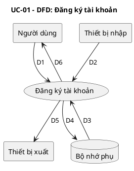
```plantuml
@startuml
title UC-01 - DFD: Đăng ký tài khoản
rectangle "Người dùng" as User
rectangle "Thiết bị nhập" as Input
usecase "Đăng ký tài khoản" as Process
rectangle "Thiết bị xuất" as Output
database "Bộ nhớ phụ" as Storage
User --> Process : D1
Process --> User : D6
Input --> Process : D2
Process --> Output : D5
Storage --> Process : D3
Process --> Storage : D4
@enduml
```
### 2.2. Đăng nhập hệ thống
#### Sơ đồ luồng dữ liệu

#### ⮚ Mô tả luồng dữ liệu
- D1: Email, mật khẩu
- D2: Yêu cầu thực hiện chức năng từ giao diện/thiết bị nhập.
- D3: Dữ liệu hiện có trong bộ nhớ phụ: D1 Người dùng, D2 Phiên/JWT phía client
- D4: Không có
- D5: Access token, refresh token, vai trò truy cập
- D6: Thông báo kết quả xử lý: thành công hoặc lỗi tương ứng.
#### ⮚ Thuật toán
- B1: Nhận D1 từ người dùng (Khách hàng/Admin).
- B2: Tiếp nhận D2 từ thiết bị nhập/giao diện.
- B3: Kết nối bộ nhớ phụ và đọc D3 (D1 Người dùng, D2 Phiên/JWT phía client).
- B4: Kiểm tra quy định nghiệp vụ: Email có tồn tại, mật khẩu khớp và tài khoản được phép truy cập?
- B5: Nếu không thỏa mãn điều kiện ở B4, trả D6 (báo lỗi) và đi đến bước B9.
- B6: Thực hiện xử lý chính của chức năng `Đăng nhập hệ thống`. Không ghi dữ liệu mới vào bộ nhớ phụ.
- B7: Trả D5 cho thiết bị xuất và trả D6 (thông báo thành công).
- B8: Đóng kết nối bộ nhớ phụ.
- B9: Kết thúc.
#### Mã PlantUML
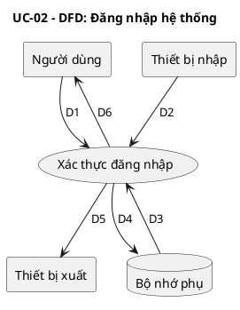
```plantuml
@startuml
title UC-02 - DFD: Đăng nhập hệ thống
rectangle "Người dùng" as User
rectangle "Thiết bị nhập" as Input
usecase "Xác thực đăng nhập" as Process
rectangle "Thiết bị xuất" as Output
database "Bộ nhớ phụ" as Storage
User --> Process : D1
Process --> User : D6
Input --> Process : D2
Process --> Output : D5
Storage --> Process : D3
Process --> Storage : D4
@enduml
```
### 2.3. Quản lý hồ sơ người dùng
#### Sơ đồ luồng dữ liệu

#### ⮚ Mô tả luồng dữ liệu
- D1: SĐT, địa chỉ, avatar, mật khẩu mới hoặc vai trò
- D2: Yêu cầu thực hiện chức năng từ giao diện/thiết bị nhập.
- D3: Dữ liệu hiện có trong bộ nhớ phụ: D1 Người dùng, D3 Tập tin ảnh/S3
- D4: Dữ liệu cần lưu/cập nhật vào bộ nhớ phụ: D1 Người dùng, D3 Tập tin ảnh/S3
- D5: Thông tin hồ sơ đã cập nhật
- D6: Thông báo kết quả xử lý: thành công hoặc lỗi tương ứng.
#### ⮚ Thuật toán
- B1: Nhận D1 từ người dùng (Khách hàng/Admin).
- B2: Tiếp nhận D2 từ thiết bị nhập/giao diện.
- B3: Kết nối bộ nhớ phụ và đọc D3 (D1 Người dùng, D3 Tập tin ảnh/S3).
- B4: Kiểm tra quy định nghiệp vụ: Người dùng có quyền cập nhật hồ sơ và dữ liệu đúng định dạng?
- B5: Nếu không thỏa mãn điều kiện ở B4, trả D6 (báo lỗi) và đi đến bước B9.
- B6: Thực hiện xử lý chính của chức năng `Quản lý hồ sơ người dùng`. Nếu chức năng làm thay đổi dữ liệu, ghi D4 vào bộ nhớ phụ.
- B7: Trả D5 cho thiết bị xuất và trả D6 (thông báo thành công).
- B8: Đóng kết nối bộ nhớ phụ.
- B9: Kết thúc.
#### Mã PlantUML
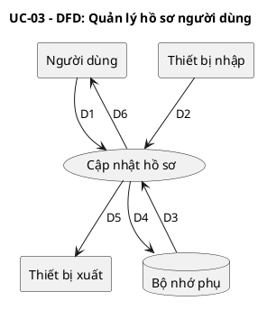
```plantuml
@startuml
title UC-03 - DFD: Quản lý hồ sơ người dùng
rectangle "Người dùng" as User
rectangle "Thiết bị nhập" as Input
usecase "Cập nhật hồ sơ" as Process
rectangle "Thiết bị xuất" as Output
database "Bộ nhớ phụ" as Storage
User --> Process : D1
Process --> User : D6
Input --> Process : D2
Process --> Output : D5
Storage --> Process : D3
Process --> Storage : D4
@enduml
```
### 2.4. Quản lý thú cưng
#### Sơ đồ luồng dữ liệu
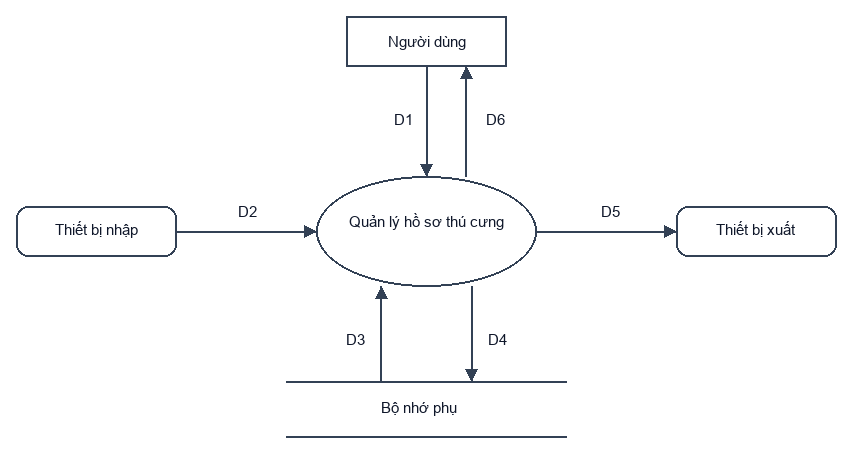
#### ⮚ Mô tả luồng dữ liệu
- D1: Tên, loài, giống, cân nặng, ghi chú, ảnh
- D2: Yêu cầu thực hiện chức năng từ giao diện/thiết bị nhập.
- D3: Dữ liệu hiện có trong bộ nhớ phụ: D4 Thú cưng, D3 Tập tin ảnh/S3
- D4: Dữ liệu cần lưu/cập nhật vào bộ nhớ phụ: D4 Thú cưng, D3 Tập tin ảnh/S3
- D5: Danh sách/hồ sơ thú cưng được cập nhật
- D6: Thông báo kết quả xử lý: thành công hoặc lỗi tương ứng.
#### ⮚ Thuật toán
- B1: Nhận D1 từ người dùng (Khách hàng).
- B2: Tiếp nhận D2 từ thiết bị nhập/giao diện.
- B3: Kết nối bộ nhớ phụ và đọc D3 (D4 Thú cưng, D3 Tập tin ảnh/S3).
- B4: Kiểm tra quy định nghiệp vụ: Thú cưng thuộc đúng chủ sở hữu và thông tin bắt buộc hợp lệ?
- B5: Nếu không thỏa mãn điều kiện ở B4, trả D6 (báo lỗi) và đi đến bước B9.
- B6: Thực hiện xử lý chính của chức năng `Quản lý thú cưng`. Nếu chức năng làm thay đổi dữ liệu, ghi D4 vào bộ nhớ phụ.
- B7: Trả D5 cho thiết bị xuất và trả D6 (thông báo thành công).
- B8: Đóng kết nối bộ nhớ phụ.
- B9: Kết thúc.
#### Mã PlantUML
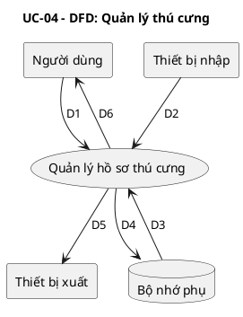
```plantuml
@startuml
title UC-04 - DFD: Quản lý thú cưng
rectangle "Người dùng" as User
rectangle "Thiết bị nhập" as Input
usecase "Quản lý hồ sơ thú cưng" as Process
rectangle "Thiết bị xuất" as Output
database "Bộ nhớ phụ" as Storage
User --> Process : D1
Process --> User : D6
Input --> Process : D2
Process --> Output : D5
Storage --> Process : D3
Process --> Storage : D4
@enduml
```
### 2.5. Xem danh sách dịch vụ
#### Sơ đồ luồng dữ liệu

#### ⮚ Mô tả luồng dữ liệu
- D1: Từ khóa, danh mục dịch vụ
- D2: Yêu cầu thực hiện chức năng từ giao diện/thiết bị nhập.
- D3: Dữ liệu hiện có trong bộ nhớ phụ: D5 Sản phẩm/Dịch vụ, D6 Danh mục
- D4: Không có
- D5: Danh sách dịch vụ, giá, thời lượng
- D6: Thông báo kết quả xử lý: thành công hoặc lỗi tương ứng.
#### ⮚ Thuật toán
- B1: Nhận D1 từ người dùng (Khách/Khách hàng).
- B2: Tiếp nhận D2 từ thiết bị nhập/giao diện.
- B3: Kết nối bộ nhớ phụ và đọc D3 (D5 Sản phẩm/Dịch vụ, D6 Danh mục).
- B4: Kiểm tra quy định nghiệp vụ: Bộ lọc/từ khóa hợp lệ và dịch vụ đang được công khai?
- B5: Nếu không thỏa mãn điều kiện ở B4, trả D6 (báo lỗi) và đi đến bước B9.
- B6: Thực hiện xử lý chính của chức năng `Xem danh sách dịch vụ`. Không ghi dữ liệu mới vào bộ nhớ phụ.
- B7: Trả D5 cho thiết bị xuất và trả D6 (thông báo thành công).
- B8: Đóng kết nối bộ nhớ phụ.
- B9: Kết thúc.
#### Mã PlantUML
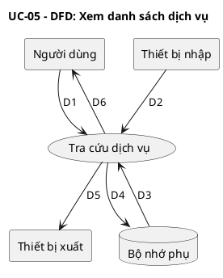
```plantuml
@startuml
title UC-05 - DFD: Xem danh sách dịch vụ
rectangle "Người dùng" as User
rectangle "Thiết bị nhập" as Input
usecase "Tra cứu dịch vụ" as Process
rectangle "Thiết bị xuất" as Output
database "Bộ nhớ phụ" as Storage
User --> Process : D1
Process --> User : D6
Input --> Process : D2
Process --> Output : D5
Storage --> Process : D3
Process --> Storage : D4
@enduml
```
### 2.6. Quản lý dịch vụ
#### Sơ đồ luồng dữ liệu
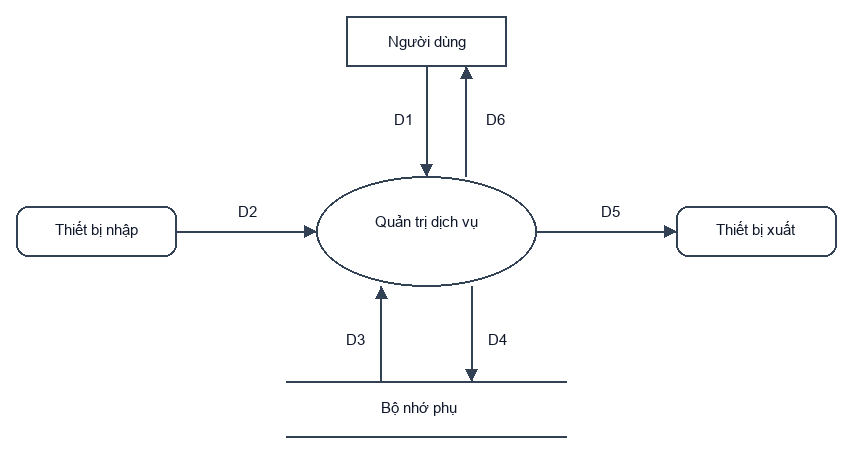
#### ⮚ Mô tả luồng dữ liệu
- D1: Tên, mô tả, giá, thời lượng, trạng thái/danh mục
- D2: Yêu cầu thực hiện chức năng từ giao diện/thiết bị nhập.
- D3: Dữ liệu hiện có trong bộ nhớ phụ: D5 Sản phẩm/Dịch vụ, D6 Danh mục
- D4: Dữ liệu cần lưu/cập nhật vào bộ nhớ phụ: D5 Sản phẩm/Dịch vụ, D6 Danh mục
- D5: Dịch vụ được thêm/sửa/xóa
- D6: Thông báo kết quả xử lý: thành công hoặc lỗi tương ứng.
#### ⮚ Thuật toán
- B1: Nhận D1 từ người dùng (Admin).
- B2: Tiếp nhận D2 từ thiết bị nhập/giao diện.
- B3: Kết nối bộ nhớ phụ và đọc D3 (D5 Sản phẩm/Dịch vụ, D6 Danh mục).
- B4: Kiểm tra quy định nghiệp vụ: Admin có quyền quản lý và giá/thời lượng dịch vụ hợp lệ?
- B5: Nếu không thỏa mãn điều kiện ở B4, trả D6 (báo lỗi) và đi đến bước B9.
- B6: Thực hiện xử lý chính của chức năng `Quản lý dịch vụ`. Nếu chức năng làm thay đổi dữ liệu, ghi D4 vào bộ nhớ phụ.
- B7: Trả D5 cho thiết bị xuất và trả D6 (thông báo thành công).
- B8: Đóng kết nối bộ nhớ phụ.
- B9: Kết thúc.
#### Mã PlantUML

```plantuml
@startuml
title UC-06 - DFD: Quản lý dịch vụ
rectangle "Người dùng" as User
rectangle "Thiết bị nhập" as Input
usecase "Quản trị dịch vụ" as Process
rectangle "Thiết bị xuất" as Output
database "Bộ nhớ phụ" as Storage
User --> Process : D1
Process --> User : D6
Input --> Process : D2
Process --> Output : D5
Storage --> Process : D3
Process --> Storage : D4
@enduml
```
### 2.7. Đặt lịch dịch vụ
#### Sơ đồ luồng dữ liệu
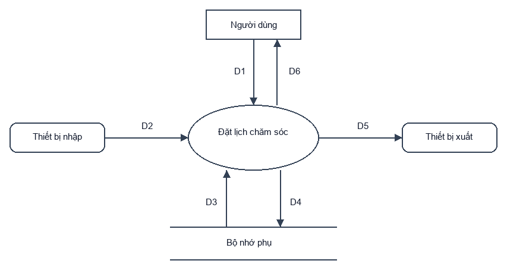
#### ⮚ Mô tả luồng dữ liệu
- D1: Thú cưng, dịch vụ, ngày giờ, ghi chú
- D2: Yêu cầu thực hiện chức năng từ giao diện/thiết bị nhập.
- D3: Dữ liệu hiện có trong bộ nhớ phụ: D4 Thú cưng, D7 Lịch hẹn, D8 Thông báo
- D4: Dữ liệu cần lưu/cập nhật vào bộ nhớ phụ: D4 Thú cưng, D7 Lịch hẹn, D8 Thông báo
- D5: Booking mới và thông báo xác nhận
- D6: Thông báo kết quả xử lý: thành công hoặc lỗi tương ứng.
#### ⮚ Thuật toán
- B1: Nhận D1 từ người dùng (Khách hàng).
- B2: Tiếp nhận D2 từ thiết bị nhập/giao diện.
- B3: Kết nối bộ nhớ phụ và đọc D3 (D4 Thú cưng, D7 Lịch hẹn, D8 Thông báo).
- B4: Kiểm tra quy định nghiệp vụ: Khách hàng có thú cưng hợp lệ, dịch vụ tồn tại và slot còn trống?
- B5: Nếu không thỏa mãn điều kiện ở B4, trả D6 (báo lỗi) và đi đến bước B9.
- B6: Thực hiện xử lý chính của chức năng `Đặt lịch dịch vụ`. Nếu chức năng làm thay đổi dữ liệu, ghi D4 vào bộ nhớ phụ.
- B7: Trả D5 cho thiết bị xuất và trả D6 (thông báo thành công).
- B8: Đóng kết nối bộ nhớ phụ.
- B9: Kết thúc.
#### Mã PlantUML
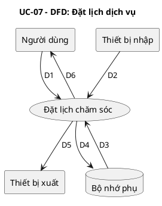
```plantuml
@startuml
title UC-07 - DFD: Đặt lịch dịch vụ
rectangle "Người dùng" as User
rectangle "Thiết bị nhập" as Input
usecase "Đặt lịch chăm sóc" as Process
rectangle "Thiết bị xuất" as Output
database "Bộ nhớ phụ" as Storage
User --> Process : D1
Process --> User : D6
Input --> Process : D2
Process --> Output : D5
Storage --> Process : D3
Process --> Storage : D4
@enduml
```
### 2.8. Quản lý nhật ký chăm sóc
#### Sơ đồ luồng dữ liệu
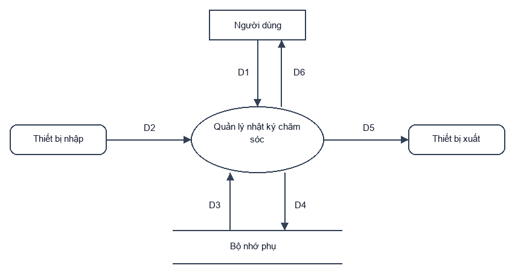
#### ⮚ Mô tả luồng dữ liệu
- D1: Hoạt động, thời gian, ghi chú, hình ảnh
- D2: Yêu cầu thực hiện chức năng từ giao diện/thiết bị nhập.
- D3: Dữ liệu hiện có trong bộ nhớ phụ: D4 Thú cưng, D9 Nhật ký chăm sóc, D3 Tập tin ảnh/S3
- D4: Dữ liệu cần lưu/cập nhật vào bộ nhớ phụ: D4 Thú cưng, D9 Nhật ký chăm sóc, D3 Tập tin ảnh/S3
- D5: Nhật ký chăm sóc được xem/cập nhật
- D6: Thông báo kết quả xử lý: thành công hoặc lỗi tương ứng.
#### ⮚ Thuật toán
- B1: Nhận D1 từ người dùng (Khách hàng/Admin).
- B2: Tiếp nhận D2 từ thiết bị nhập/giao diện.
- B3: Kết nối bộ nhớ phụ và đọc D3 (D4 Thú cưng, D9 Nhật ký chăm sóc, D3 Tập tin ảnh/S3).
- B4: Kiểm tra quy định nghiệp vụ: Người dùng có quyền xem/cập nhật nhật ký của thú cưng?
- B5: Nếu không thỏa mãn điều kiện ở B4, trả D6 (báo lỗi) và đi đến bước B9.
- B6: Thực hiện xử lý chính của chức năng `Quản lý nhật ký chăm sóc`. Nếu chức năng làm thay đổi dữ liệu, ghi D4 vào bộ nhớ phụ.
- B7: Trả D5 cho thiết bị xuất và trả D6 (thông báo thành công).
- B8: Đóng kết nối bộ nhớ phụ.
- B9: Kết thúc.
#### Mã PlantUML
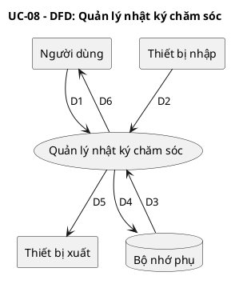
```plantuml
@startuml
title UC-08 - DFD: Quản lý nhật ký chăm sóc
rectangle "Người dùng" as User
rectangle "Thiết bị nhập" as Input
usecase "Quản lý nhật ký chăm sóc" as Process
rectangle "Thiết bị xuất" as Output
database "Bộ nhớ phụ" as Storage
User --> Process : D1
Process --> User : D6
Input --> Process : D2
Process --> Output : D5
Storage --> Process : D3
Process --> Storage : D4
@enduml
```
### 2.9. Mua sắm sản phẩm
#### Sơ đồ luồng dữ liệu
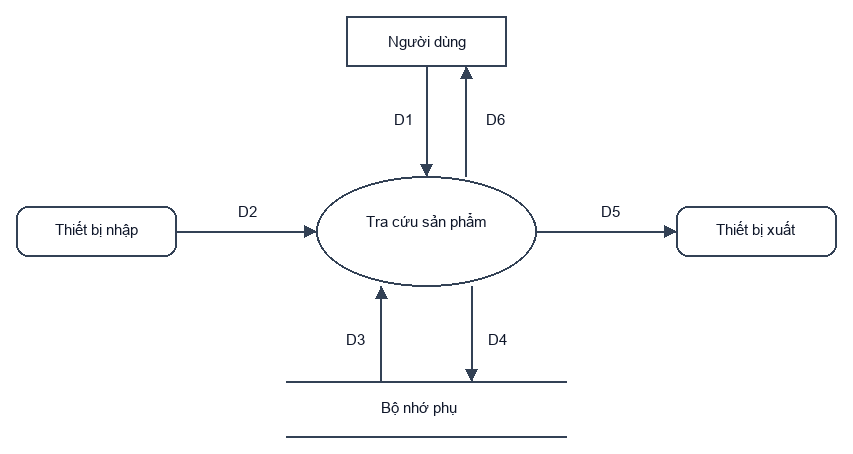
#### ⮚ Mô tả luồng dữ liệu
- D1: Từ khóa, danh mục, sản phẩm cần xem
- D2: Yêu cầu thực hiện chức năng từ giao diện/thiết bị nhập.
- D3: Dữ liệu hiện có trong bộ nhớ phụ: D5 Sản phẩm/Dịch vụ, D6 Danh mục
- D4: Không có
- D5: Danh sách/chi tiết sản phẩm, trạng thái tồn kho
- D6: Thông báo kết quả xử lý: thành công hoặc lỗi tương ứng.
#### ⮚ Thuật toán
- B1: Nhận D1 từ người dùng (Khách/Khách hàng).
- B2: Tiếp nhận D2 từ thiết bị nhập/giao diện.
- B3: Kết nối bộ nhớ phụ và đọc D3 (D5 Sản phẩm/Dịch vụ, D6 Danh mục).
- B4: Kiểm tra quy định nghiệp vụ: Sản phẩm thuộc danh mục hợp lệ và còn trạng thái hiển thị?
- B5: Nếu không thỏa mãn điều kiện ở B4, trả D6 (báo lỗi) và đi đến bước B9.
- B6: Thực hiện xử lý chính của chức năng `Mua sắm sản phẩm`. Không ghi dữ liệu mới vào bộ nhớ phụ.
- B7: Trả D5 cho thiết bị xuất và trả D6 (thông báo thành công).
- B8: Đóng kết nối bộ nhớ phụ.
- B9: Kết thúc.
#### Mã PlantUML

```plantuml
@startuml
title UC-09 - DFD: Mua sắm sản phẩm
rectangle "Người dùng" as User
rectangle "Thiết bị nhập" as Input
usecase "Tra cứu sản phẩm" as Process
rectangle "Thiết bị xuất" as Output
database "Bộ nhớ phụ" as Storage
User --> Process : D1
Process --> User : D6
Input --> Process : D2
Process --> Output : D5
Storage --> Process : D3
Process --> Storage : D4
@enduml
```
### 2.10. Quản lý giỏ hàng
#### Sơ đồ luồng dữ liệu

#### ⮚ Mô tả luồng dữ liệu
- D1: Sản phẩm, số lượng thêm/sửa/xóa
- D2: Yêu cầu thực hiện chức năng từ giao diện/thiết bị nhập.
- D3: Dữ liệu hiện có trong bộ nhớ phụ: D5 Sản phẩm/Dịch vụ, D10 Giỏ hàng
- D4: Dữ liệu cần lưu/cập nhật vào bộ nhớ phụ: D5 Sản phẩm/Dịch vụ, D10 Giỏ hàng
- D5: Giỏ hàng và tổng tiền mới
- D6: Thông báo kết quả xử lý: thành công hoặc lỗi tương ứng.
#### ⮚ Thuật toán
- B1: Nhận D1 từ người dùng (Khách hàng).
- B2: Tiếp nhận D2 từ thiết bị nhập/giao diện.
- B3: Kết nối bộ nhớ phụ và đọc D3 (D5 Sản phẩm/Dịch vụ, D10 Giỏ hàng).
- B4: Kiểm tra quy định nghiệp vụ: Sản phẩm tồn tại, số lượng hợp lệ và không vượt tồn kho?
- B5: Nếu không thỏa mãn điều kiện ở B4, trả D6 (báo lỗi) và đi đến bước B9.
- B6: Thực hiện xử lý chính của chức năng `Quản lý giỏ hàng`. Nếu chức năng làm thay đổi dữ liệu, ghi D4 vào bộ nhớ phụ.
- B7: Trả D5 cho thiết bị xuất và trả D6 (thông báo thành công).
- B8: Đóng kết nối bộ nhớ phụ.
- B9: Kết thúc.
#### Mã PlantUML
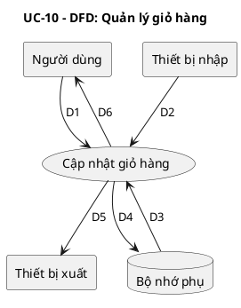
```plantuml
@startuml
title UC-10 - DFD: Quản lý giỏ hàng
rectangle "Người dùng" as User
rectangle "Thiết bị nhập" as Input
usecase "Cập nhật giỏ hàng" as Process
rectangle "Thiết bị xuất" as Output
database "Bộ nhớ phụ" as Storage
User --> Process : D1
Process --> User : D6
Input --> Process : D2
Process --> Output : D5
Storage --> Process : D3
Process --> Storage : D4
@enduml
```
### 2.11. Tạo đơn hàng
#### Sơ đồ luồng dữ liệu

#### ⮚ Mô tả luồng dữ liệu
- D1: Giỏ hàng, địa chỉ, ghi chú, phí vận chuyển, phương thức thanh toán
- D2: Yêu cầu thực hiện chức năng từ giao diện/thiết bị nhập.
- D3: Dữ liệu hiện có trong bộ nhớ phụ: D10 Giỏ hàng, D11 Đơn hàng, D5 Sản phẩm/Dịch vụ; dữ liệu tích hợp ngoài: GHN Shipping API
- D4: Dữ liệu cần lưu/cập nhật vào bộ nhớ phụ: D10 Giỏ hàng, D11 Đơn hàng, D5 Sản phẩm/Dịch vụ
- D5: Mã đơn hàng, tổng tiền, trạng thái chờ thanh toán/COD
- D6: Thông báo kết quả xử lý: thành công hoặc lỗi tương ứng.
#### ⮚ Thuật toán
- B1: Nhận D1 từ người dùng (Khách hàng).
- B2: Tiếp nhận D2 từ thiết bị nhập/giao diện.
- B3: Kết nối bộ nhớ phụ và đọc D3 (D10 Giỏ hàng, D11 Đơn hàng, D5 Sản phẩm/Dịch vụ).
- B4: Kiểm tra quy định nghiệp vụ: Giỏ hàng có sản phẩm, địa chỉ giao hàng hợp lệ và tồn kho đủ?
- B5: Nếu không thỏa mãn điều kiện ở B4, trả D6 (báo lỗi) và đi đến bước B9.
- B6: Thực hiện xử lý chính của chức năng `Tạo đơn hàng`. Nếu chức năng làm thay đổi dữ liệu, ghi D4 vào bộ nhớ phụ. Nếu cần, trao đổi dữ liệu với hệ thống ngoài (GHN Shipping API).
- B7: Trả D5 cho thiết bị xuất và trả D6 (thông báo thành công).
- B8: Đóng kết nối bộ nhớ phụ.
- B9: Kết thúc.
#### Mã PlantUML
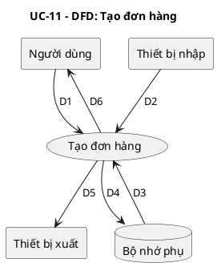
```plantuml
@startuml
title UC-11 - DFD: Tạo đơn hàng
rectangle "Người dùng" as User
rectangle "Thiết bị nhập" as Input
usecase "Tạo đơn hàng" as Process
rectangle "Thiết bị xuất" as Output
database "Bộ nhớ phụ" as Storage
User --> Process : D1
Process --> User : D6
Input --> Process : D2
Process --> Output : D5
Storage --> Process : D3
Process --> Storage : D4
@enduml
```
### 2.12. Thanh toán đơn hàng
#### Sơ đồ luồng dữ liệu

#### ⮚ Mô tả luồng dữ liệu
- D1: Mã đơn hàng, phương thức thanh toán, callback giao dịch
- D2: Yêu cầu thực hiện chức năng từ giao diện/thiết bị nhập.
- D3: Dữ liệu hiện có trong bộ nhớ phụ: D11 Đơn hàng, D8 Thông báo; dữ liệu tích hợp ngoài: VNPAY
- D4: Dữ liệu cần lưu/cập nhật vào bộ nhớ phụ: D11 Đơn hàng, D8 Thông báo
- D5: Trạng thái thanh toán đã cập nhật
- D6: Thông báo kết quả xử lý: thành công hoặc lỗi tương ứng.
#### ⮚ Thuật toán
- B1: Nhận D1 từ người dùng (Khách hàng).
- B2: Tiếp nhận D2 từ thiết bị nhập/giao diện.
- B3: Kết nối bộ nhớ phụ và đọc D3 (D11 Đơn hàng, D8 Thông báo).
- B4: Kiểm tra quy định nghiệp vụ: Đơn hàng tồn tại, còn chờ thanh toán và phản hồi cổng thanh toán hợp lệ?
- B5: Nếu không thỏa mãn điều kiện ở B4, trả D6 (báo lỗi) và đi đến bước B9.
- B6: Thực hiện xử lý chính của chức năng `Thanh toán đơn hàng`. Nếu chức năng làm thay đổi dữ liệu, ghi D4 vào bộ nhớ phụ. Nếu cần, trao đổi dữ liệu với hệ thống ngoài (VNPAY).
- B7: Trả D5 cho thiết bị xuất và trả D6 (thông báo thành công).
- B8: Đóng kết nối bộ nhớ phụ.
- B9: Kết thúc.
#### Mã PlantUML

```plantuml
@startuml
title UC-12 - DFD: Thanh toán đơn hàng
rectangle "Người dùng" as User
rectangle "Thiết bị nhập" as Input
usecase "Xử lý thanh toán" as Process
rectangle "Thiết bị xuất" as Output
database "Bộ nhớ phụ" as Storage
User --> Process : D1
Process --> User : D6
Input --> Process : D2
Process --> Output : D5
Storage --> Process : D3
Process --> Storage : D4
@enduml
```
### 2.13. Xem và xử lý thông báo
#### Sơ đồ luồng dữ liệu

#### ⮚ Mô tả luồng dữ liệu
- D1: Yêu cầu xem, đánh dấu đã đọc, xóa thông báo
- D2: Yêu cầu thực hiện chức năng từ giao diện/thiết bị nhập.
- D3: Dữ liệu hiện có trong bộ nhớ phụ: D8 Thông báo
- D4: Dữ liệu cần lưu/cập nhật vào bộ nhớ phụ: D8 Thông báo
- D5: Danh sách thông báo, trạng thái đã đọc
- D6: Thông báo kết quả xử lý: thành công hoặc lỗi tương ứng.
#### ⮚ Thuật toán
- B1: Nhận D1 từ người dùng (Khách hàng/Admin).
- B2: Tiếp nhận D2 từ thiết bị nhập/giao diện.
- B3: Kết nối bộ nhớ phụ và đọc D3 (D8 Thông báo).
- B4: Kiểm tra quy định nghiệp vụ: Thông báo thuộc đúng người dùng và thao tác đọc/xóa hợp lệ?
- B5: Nếu không thỏa mãn điều kiện ở B4, trả D6 (báo lỗi) và đi đến bước B9.
- B6: Thực hiện xử lý chính của chức năng `Xem và xử lý thông báo`. Nếu chức năng làm thay đổi dữ liệu, ghi D4 vào bộ nhớ phụ.
- B7: Trả D5 cho thiết bị xuất và trả D6 (thông báo thành công).
- B8: Đóng kết nối bộ nhớ phụ.
- B9: Kết thúc.
#### Mã PlantUML
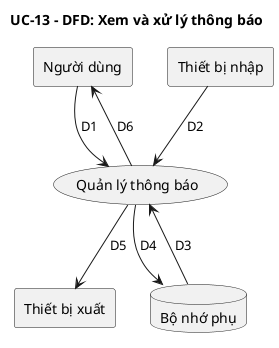
```plantuml
@startuml
title UC-13 - DFD: Xem và xử lý thông báo
rectangle "Người dùng" as User
rectangle "Thiết bị nhập" as Input
usecase "Quản lý thông báo" as Process
rectangle "Thiết bị xuất" as Output
database "Bộ nhớ phụ" as Storage
User --> Process : D1
Process --> User : D6
Input --> Process : D2
Process --> Output : D5
Storage --> Process : D3
Process --> Storage : D4
@enduml
```
### 2.14. Quản lý báo cáo thống kê
#### Sơ đồ luồng dữ liệu

#### ⮚ Mô tả luồng dữ liệu
- D1: Khoảng thời gian, loại báo cáo doanh thu/booking
- D2: Yêu cầu thực hiện chức năng từ giao diện/thiết bị nhập.
- D3: Dữ liệu hiện có trong bộ nhớ phụ: D7 Lịch hẹn, D11 Đơn hàng, D5 Sản phẩm/Dịch vụ
- D4: Không có
- D5: Biểu đồ, bảng chi tiết, file Excel/PDF
- D6: Thông báo kết quả xử lý: thành công hoặc lỗi tương ứng.
#### ⮚ Thuật toán
- B1: Nhận D1 từ người dùng (Admin).
- B2: Tiếp nhận D2 từ thiết bị nhập/giao diện.
- B3: Kết nối bộ nhớ phụ và đọc D3 (D7 Lịch hẹn, D11 Đơn hàng, D5 Sản phẩm/Dịch vụ).
- B4: Kiểm tra quy định nghiệp vụ: Admin có quyền xem báo cáo và khoảng thời gian hợp lệ?
- B5: Nếu không thỏa mãn điều kiện ở B4, trả D6 (báo lỗi) và đi đến bước B9.
- B6: Thực hiện xử lý chính của chức năng `Quản lý báo cáo thống kê`. Không ghi dữ liệu mới vào bộ nhớ phụ.
- B7: Trả D5 cho thiết bị xuất và trả D6 (thông báo thành công).
- B8: Đóng kết nối bộ nhớ phụ.
- B9: Kết thúc.
#### Mã PlantUML
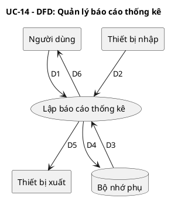
```plantuml
@startuml
title UC-14 - DFD: Quản lý báo cáo thống kê
rectangle "Người dùng" as User
rectangle "Thiết bị nhập" as Input
usecase "Lập báo cáo thống kê" as Process
rectangle "Thiết bị xuất" as Output
database "Bộ nhớ phụ" as Storage
User --> Process : D1
Process --> User : D6
Input --> Process : D2
Process --> Output : D5
Storage --> Process : D3
Process --> Storage : D4
@enduml
```
## 4. Sơ đồ Tuần tự (Sequence Diagram)
Sequence Diagram thể hiện tương tác theo thời gian ở mức phân tích thiết kế. Các đối tượng được mô hình hóa theo vai trò nghiệp vụ như `Giao diện`, `Hệ thống`, `Authentication`, `Cơ sở dữ liệu` và hệ thống ngoài khi cần. Các use case liên quan được gộp thành một sequence để thể hiện rõ nhánh xử lý.
### 4.1. Đăng ký / Đăng nhập
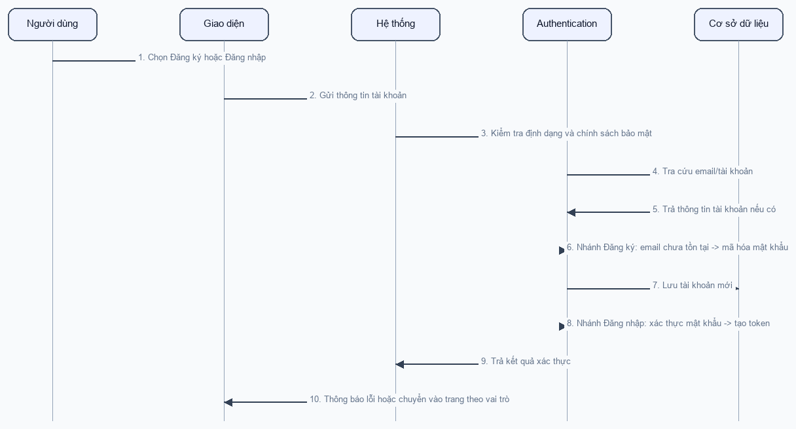
#### Mã PlantUML
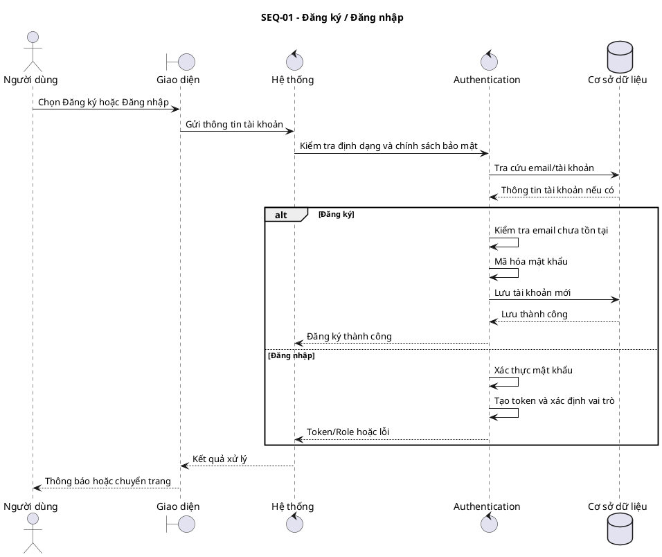
```plantuml
@startuml
title SEQ-01 - Đăng ký / Đăng nhập
actor "Người dùng" as User
boundary "Giao diện" as UI
control "Hệ thống" as System
control "Authentication" as Auth
database "Cơ sở dữ liệu" as DB
User -> UI : Chọn Đăng ký hoặc Đăng nhập
UI -> System : Gửi thông tin tài khoản
System -> Auth : Kiểm tra định dạng và chính sách bảo mật
Auth -> DB : Tra cứu email/tài khoản
DB --> Auth : Thông tin tài khoản nếu có
alt Đăng ký
  Auth -> Auth : Kiểm tra email chưa tồn tại
  Auth -> Auth : Mã hóa mật khẩu
  Auth -> DB : Lưu tài khoản mới
  DB --> Auth : Lưu thành công
  Auth --> System : Đăng ký thành công
else Đăng nhập
  Auth -> Auth : Xác thực mật khẩu
  Auth -> Auth : Tạo token và xác định vai trò
  Auth --> System : Token/Role hoặc lỗi
end
System --> UI : Kết quả xử lý
UI --> User : Thông báo hoặc chuyển trang
@enduml
```
### 4.2. Quản lý hồ sơ người dùng
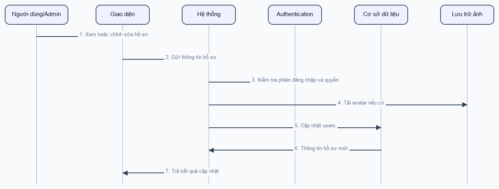
#### Mã PlantUML
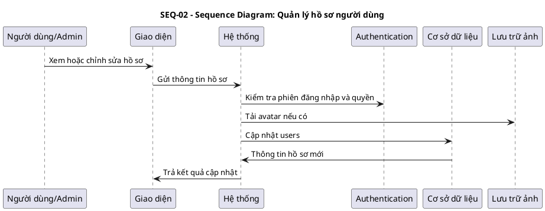
```plantuml
@startuml
title SEQ-02 - Sequence Diagram: Quản lý hồ sơ người dùng
participant "Người dùng/Admin" as P1
participant "Giao diện" as P2
participant "Hệ thống" as P3
participant "Authentication" as P4
participant "Cơ sở dữ liệu" as P5
participant "Lưu trữ ảnh" as P6
P1 -> P2 : Xem hoặc chỉnh sửa hồ sơ
P2 -> P3 : Gửi thông tin hồ sơ
P3 -> P4 : Kiểm tra phiên đăng nhập và quyền
P3 -> P6 : Tải avatar nếu có
P3 -> P5 : Cập nhật users
P5 -> P3 : Thông tin hồ sơ mới
P3 -> P2 : Trả kết quả cập nhật
@enduml
```
### 4.3. Quản lý thú cưng / Nhật ký chăm sóc
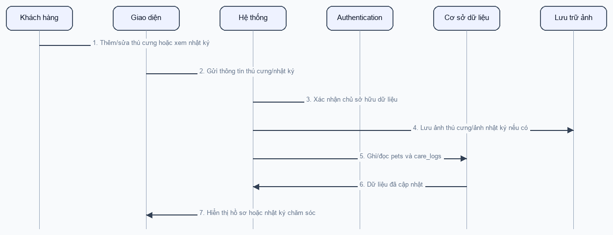
#### Mã PlantUML
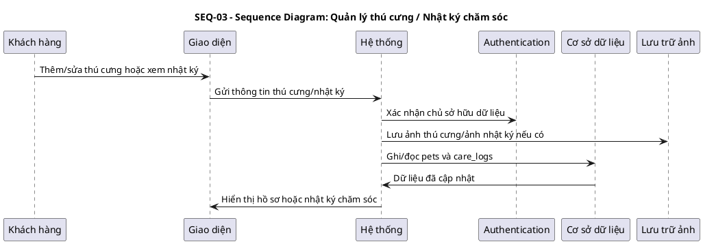
```plantuml
@startuml
title SEQ-03 - Sequence Diagram: Quản lý thú cưng / Nhật ký chăm sóc
participant "Khách hàng" as P1
participant "Giao diện" as P2
participant "Hệ thống" as P3
participant "Authentication" as P4
participant "Cơ sở dữ liệu" as P5
participant "Lưu trữ ảnh" as P6
P1 -> P2 : Thêm/sửa thú cưng hoặc xem nhật ký
P2 -> P3 : Gửi thông tin thú cưng/nhật ký
P3 -> P4 : Xác nhận chủ sở hữu dữ liệu
P3 -> P6 : Lưu ảnh thú cưng/ảnh nhật ký nếu có
P3 -> P5 : Ghi/đọc pets và care_logs
P5 -> P3 : Dữ liệu đã cập nhật
P3 -> P2 : Hiển thị hồ sơ hoặc nhật ký chăm sóc
@enduml
```
### 4.4. Tra cứu / Quản lý dịch vụ và sản phẩm
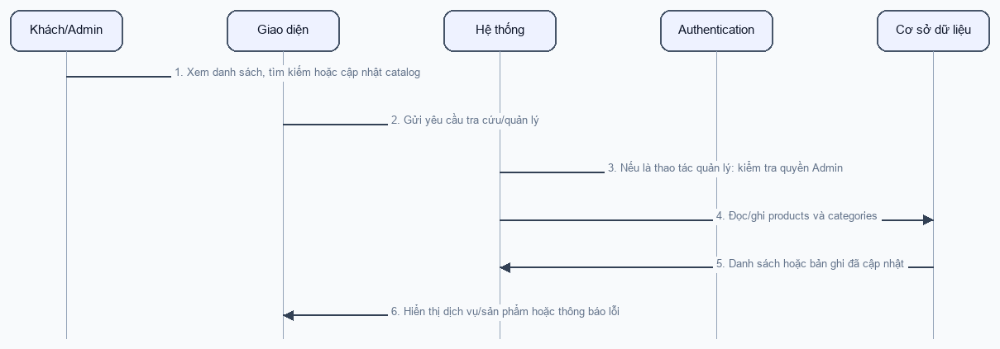
#### Mã PlantUML
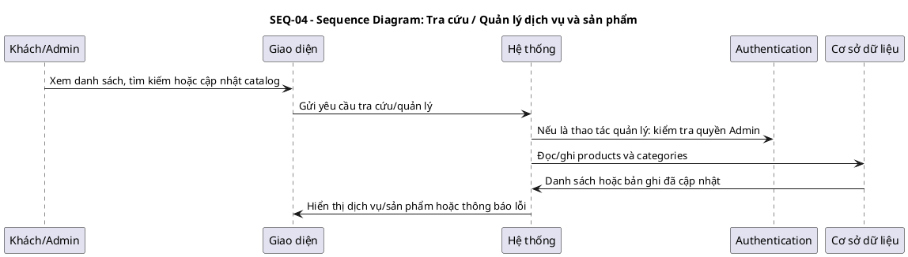
```plantuml
@startuml
title SEQ-04 - Sequence Diagram: Tra cứu / Quản lý dịch vụ và sản phẩm
participant "Khách/Admin" as P1
participant "Giao diện" as P2
participant "Hệ thống" as P3
participant "Authentication" as P4
participant "Cơ sở dữ liệu" as P5
P1 -> P2 : Xem danh sách, tìm kiếm hoặc cập nhật catalog
P2 -> P3 : Gửi yêu cầu tra cứu/quản lý
P3 -> P4 : Nếu là thao tác quản lý: kiểm tra quyền Admin
P3 -> P5 : Đọc/ghi products và categories
P5 -> P3 : Danh sách hoặc bản ghi đã cập nhật
P3 -> P2 : Hiển thị dịch vụ/sản phẩm hoặc thông báo lỗi
@enduml
```
### 4.5. Đặt lịch dịch vụ
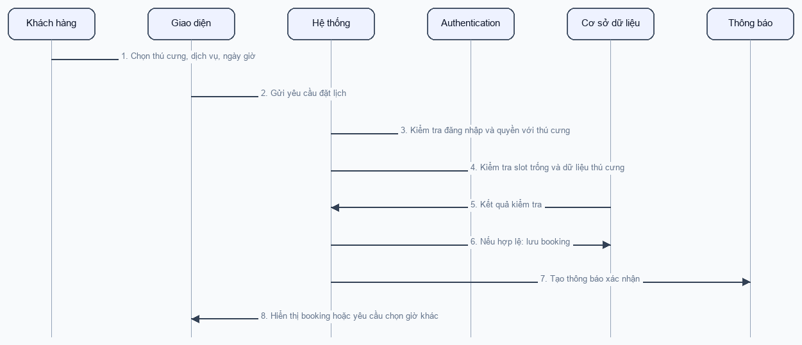
#### Mã PlantUML
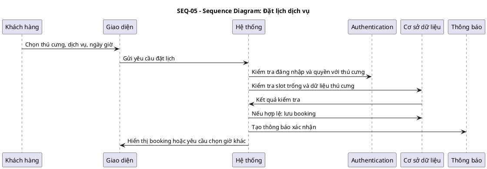
```plantuml
@startuml
title SEQ-05 - Sequence Diagram: Đặt lịch dịch vụ
participant "Khách hàng" as P1
participant "Giao diện" as P2
participant "Hệ thống" as P3
participant "Authentication" as P4
participant "Cơ sở dữ liệu" as P5
participant "Thông báo" as P6
P1 -> P2 : Chọn thú cưng, dịch vụ, ngày giờ
P2 -> P3 : Gửi yêu cầu đặt lịch
P3 -> P4 : Kiểm tra đăng nhập và quyền với thú cưng
P3 -> P5 : Kiểm tra slot trống và dữ liệu thú cưng
P5 -> P3 : Kết quả kiểm tra
P3 -> P5 : Nếu hợp lệ: lưu booking
P3 -> P6 : Tạo thông báo xác nhận
P3 -> P2 : Hiển thị booking hoặc yêu cầu chọn giờ khác
@enduml
```
### 4.6. Giỏ hàng / Tạo đơn hàng / Thanh toán
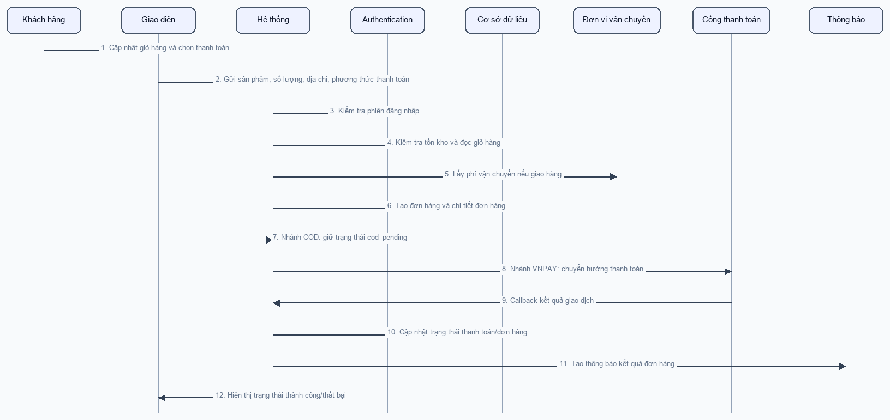
#### Mã PlantUML
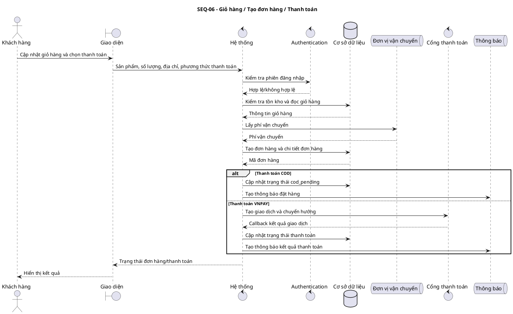
```plantuml
@startuml
title SEQ-06 - Giỏ hàng / Tạo đơn hàng / Thanh toán
actor "Khách hàng" as User
boundary "Giao diện" as UI
control "Hệ thống" as System
control "Authentication" as Auth
database "Cơ sở dữ liệu" as DB
queue "Đơn vị vận chuyển" as Ship
control "Cổng thanh toán" as Pay
queue "Thông báo" as Noti
User -> UI : Cập nhật giỏ hàng và chọn thanh toán
UI -> System : Sản phẩm, số lượng, địa chỉ, phương thức thanh toán
System -> Auth : Kiểm tra phiên đăng nhập
Auth --> System : Hợp lệ/không hợp lệ
System -> DB : Kiểm tra tồn kho và đọc giỏ hàng
DB --> System : Thông tin giỏ hàng
System -> Ship : Lấy phí vận chuyển
Ship --> System : Phí vận chuyển
System -> DB : Tạo đơn hàng và chi tiết đơn hàng
DB --> System : Mã đơn hàng
alt Thanh toán COD
  System -> DB : Cập nhật trạng thái cod_pending
  System -> Noti : Tạo thông báo đặt hàng
else Thanh toán VNPAY
  System -> Pay : Tạo giao dịch và chuyển hướng
  Pay --> System : Callback kết quả giao dịch
  System -> DB : Cập nhật trạng thái thanh toán
  System -> Noti : Tạo thông báo kết quả thanh toán
end
System --> UI : Trạng thái đơn hàng/thanh toán
UI --> User : Hiển thị kết quả
@enduml
```
### 4.7. Xem và xử lý thông báo
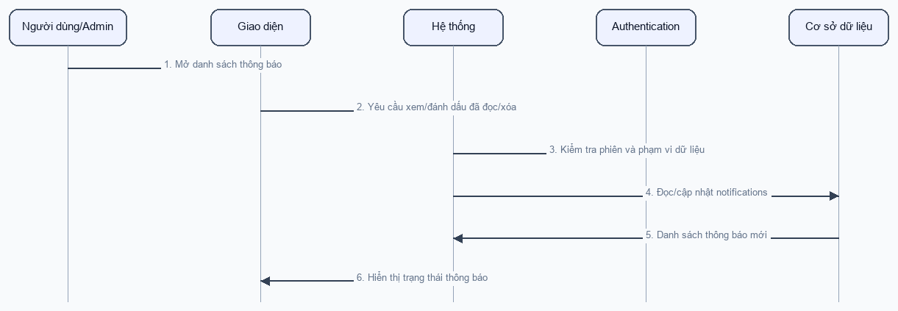
#### Mã PlantUML
```plantuml
@startuml
title SEQ-07 - Sequence Diagram: Xem và xử lý thông báo
participant "Người dùng/Admin" as P1
participant "Giao diện" as P2
participant "Hệ thống" as P3
participant "Authentication" as P4
participant "Cơ sở dữ liệu" as P5
P1 -> P2 : Mở danh sách thông báo
P2 -> P3 : Yêu cầu xem/đánh dấu đã đọc/xóa
P3 -> P4 : Kiểm tra phiên và phạm vi dữ liệu
P3 -> P5 : Đọc/cập nhật notifications
P5 -> P3 : Danh sách thông báo mới
P3 -> P2 : Hiển thị trạng thái thông báo
@enduml
```
### 4.8. Quản lý báo cáo thống kê
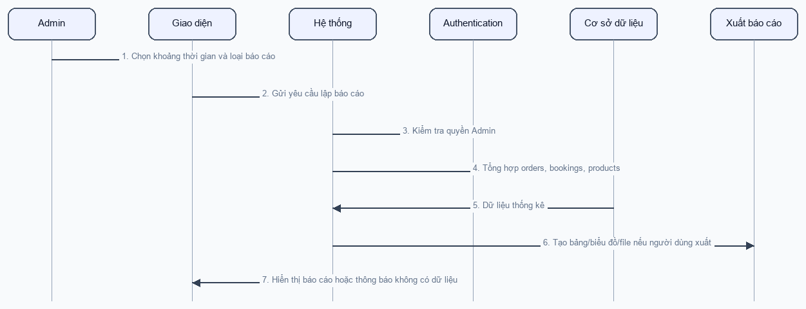
#### Mã PlantUML
```plantuml
@startuml
title SEQ-08 - Sequence Diagram: Quản lý báo cáo thống kê
participant "Admin" as P1
participant "Giao diện" as P2
participant "Hệ thống" as P3
participant "Authentication" as P4
participant "Cơ sở dữ liệu" as P5
participant "Xuất báo cáo" as P6
P1 -> P2 : Chọn khoảng thời gian và loại báo cáo
P2 -> P3 : Gửi yêu cầu lập báo cáo
P3 -> P4 : Kiểm tra quyền Admin
P3 -> P5 : Tổng hợp orders, bookings, products
P5 -> P3 : Dữ liệu thống kê
P3 -> P6 : Tạo bảng/biểu đồ/file nếu người dùng xuất
P3 -> P2 : Hiển thị báo cáo hoặc thông báo không có dữ liệu
@enduml
```
# V. THIẾT KẾ HỆ THỐNG
## 1. Kiến trúc hệ thống
Hệ thống PetCare được xây dựng theo mô hình Client-Server. Frontend React/Vite chịu trách nhiệm giao diện và điều hướng; Backend FastAPI xử lý API, xác thực, nghiệp vụ và tích hợp ngoài; PostgreSQL lưu trữ dữ liệu nghiệp vụ. Kiến trúc hiện tại là modular monolith theo lớp, dễ triển khai bằng Docker Compose và vẫn tách rõ các module nghiệp vụ.
### 1.1. Sơ đồ kiến trúc
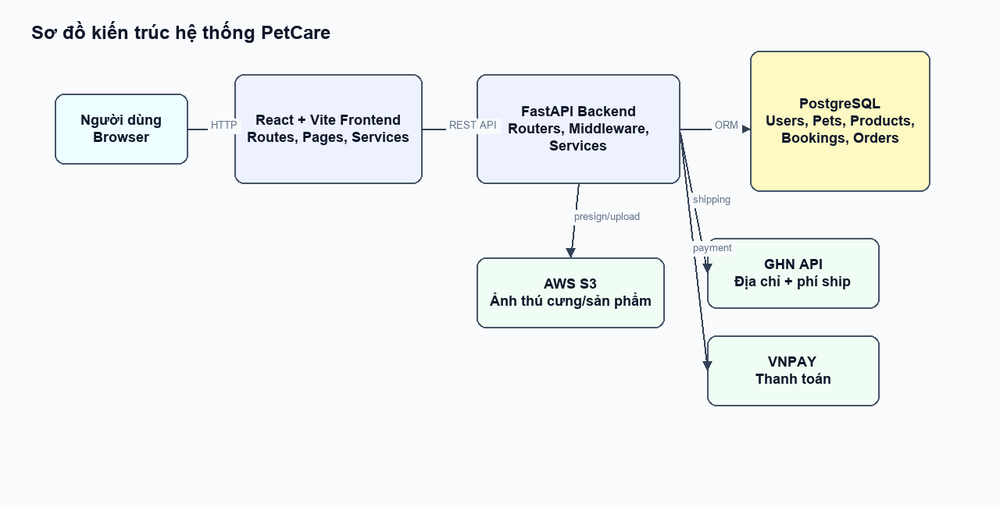
```plantuml
@startuml
title Sơ đồ kiến trúc hệ thống PetCare
actor "Người dùng" as User
node "Browser" {
  component "React + Vite Frontend\nPages, Routes, API Client" as FE
}
node "Backend Container" {
  component "FastAPI App" as API
  component "Routers" as Routers
  component "Services" as Services
  component "Repositories" as Repos
}
database "PostgreSQL" as DB
cloud "AWS S3" as S3
cloud "GHN API" as GHN
cloud "VNPAY" as VNPAY
User --> FE
FE --> API : HTTP/JSON
API --> Routers
Routers --> Services
Services --> Repos
Repos --> DB : SQLAlchemy async
Services --> S3 : presigned upload/image
Services --> GHN : shipping quote/address
Services --> VNPAY : payment URL/callback
@enduml
```
### 1.2. Phân lớp backend
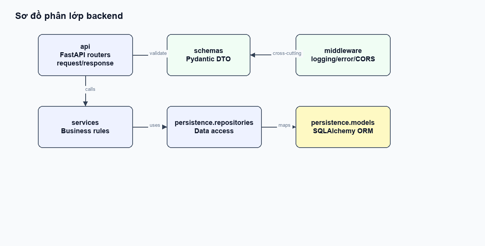
```plantuml
@startuml
title Sơ đồ phân lớp backend PetCare
package api {
  [auth.py]
  [users.py]
  [pets.py]
  [bookings.py]
  [orders.py]
  [reports.py]
}
package schemas {
  [Pydantic Request/Response]
}
package services {
  [AuthService]
  [PetService]
  [BookingService]
  [OrderService]
  [ReportService]
}
package persistence {
  [Repositories] --> [SQLAlchemy Models]
}
[api] --> [schemas]
[api] --> [services]
[services] --> [Repositories]
[Repositories] --> [SQLAlchemy Models]
@enduml
```
## 2. Thiết kế thành phần
- Frontend: `pages` hiển thị màn hình, `services` gọi HTTP API, `contexts/AuthContext` quản lý phiên đăng nhập, `ProtectedRoute` kiểm soát truy cập.
- Backend API: các router `auth`, `users`, `pets`, `products`, `bookings`, `care_logs`, `carts`, `orders`, `payments`, `reports`, `notifications`, `admin`.
- Service layer: xử lý quy tắc nghiệp vụ như xác thực, kiểm tra quyền sở hữu thú cưng, kiểm tra slot đặt lịch, tính tổng giỏ hàng, tạo đơn hàng, tạo URL thanh toán, tổng hợp báo cáo.
- Repository layer: truy vấn và cập nhật dữ liệu qua SQLAlchemy async ORM.
- Tích hợp ngoài: S3 lưu ảnh, GHN lấy địa chỉ/phí vận chuyển, VNPAY xử lý thanh toán trực tuyến.
## 3. Thiết kế dữ liệu mức hệ thống
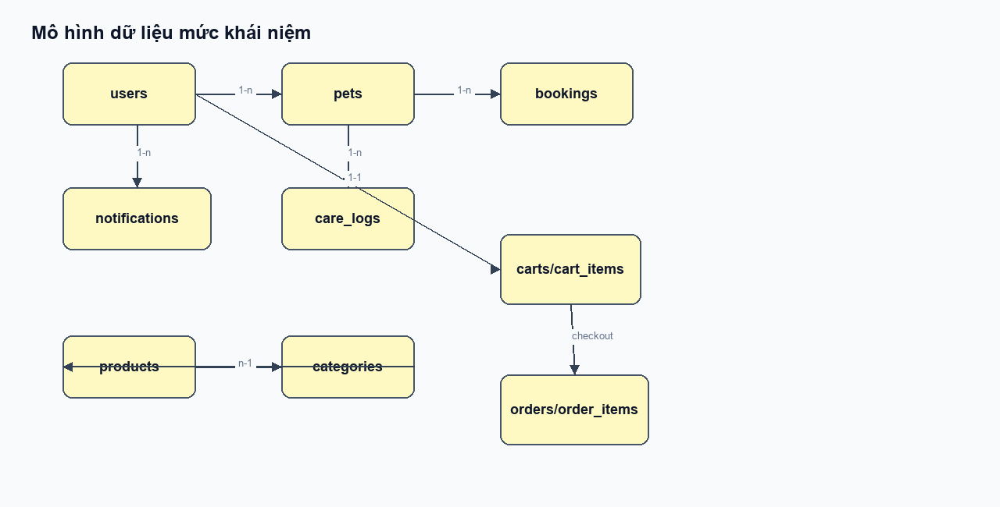
```plantuml
@startuml
title Mô hình dữ liệu mức khái niệm
entity users
entity pets
entity products
entity categories
entity bookings
entity care_logs
entity carts
entity cart_items
entity orders
entity order_items
entity notifications
users ||--o{ pets
users ||--o{ bookings
users ||--o{ care_logs
users ||--o{ orders
users ||--o{ notifications
users ||--|| carts
pets ||--o{ bookings
pets ||--o{ care_logs
categories ||--o{ products
carts ||--o{ cart_items
products ||--o{ cart_items
orders ||--o{ order_items
products ||--o{ order_items
@enduml
```
## 4. Thiết kế bảo mật và vận hành
- Xác thực bằng JWT access/refresh token; phân quyền theo vai trò `user` và `admin`.
- API quản trị yêu cầu quyền admin; dữ liệu cá nhân như pets, bookings, cart, orders, notifications được lọc theo `user_id`.
- Middleware xử lý logging, lỗi tập trung và CORS cho frontend local.
- Docker Compose vận hành frontend, backend và PostgreSQL; Alembic quản lý migration.
## 5. Ánh xạ Use Case - Module triển khai
| Use Case | Frontend | Backend/API | Bảng dữ liệu chính |
|---|---|---|---|
| UC-01, UC-02 | auth/Login, auth/Register | auth.py, auth_service.py | users |
| UC-03 | profile/Profile, admin/Users | users.py, admin.py | users |
| UC-04 | pets/* | pets.py, pet_service.py | pets |
| UC-05, UC-06, UC-09 | services/*, shop/* | products.py, categories.py | products, categories |
| UC-07 | bookings/* | bookings.py, booking_service.py | bookings, pets, notifications |
| UC-08 | care/* | care_logs.py, care_log_service.py | care_logs, pets |
| UC-10 | cart/Cart | carts.py, cart_service.py | carts, cart_items |
| UC-11, UC-12 | cart/Checkout, orders/*, payment/* | orders.py, payments.py | orders, order_items |
| UC-13 | notifications/Notifications | notifications.py | notifications |
| UC-14 | reports/Reports | reports.py, report_service.py | orders, bookings |
